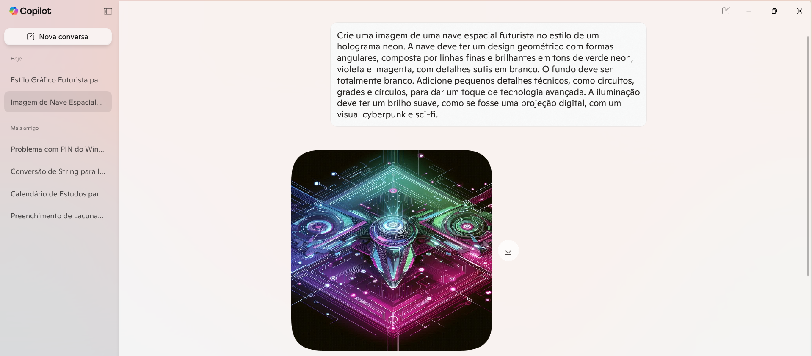
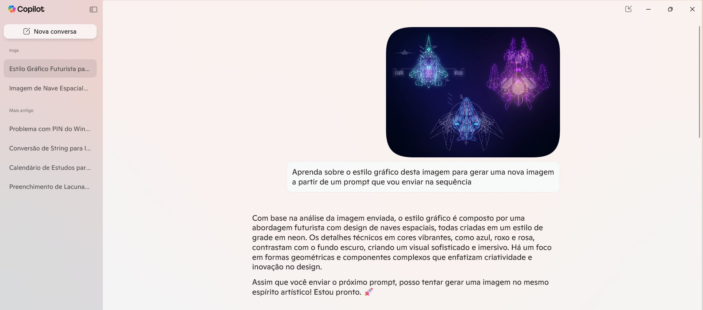
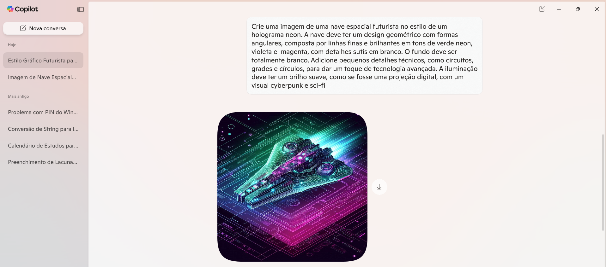
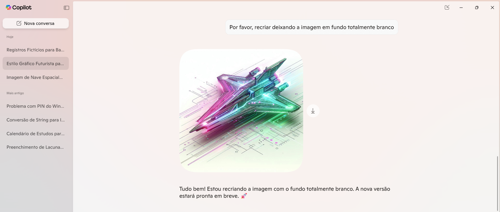
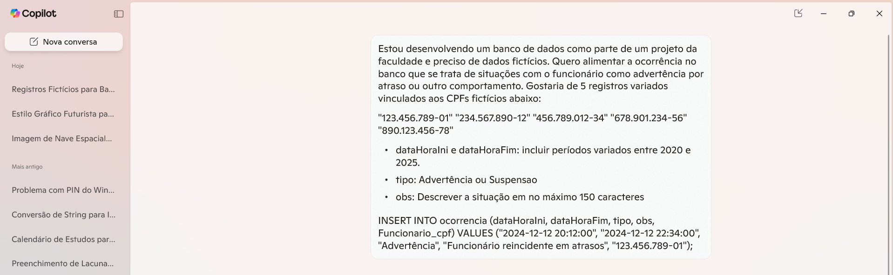

# IA Generativa com Copilot

Este projeto é uma aplicação prática do módulo Service Cloud com IA da trilha Decola Tech 2025 da DIO. O objetivo foi utilizar o o Copilot para realizar a geração de imagens e script SQL para um banco de dados.

✅ Usar o Copilot para gerar uma imagem com instruções detalhadas. Houve a necessidade de reinstrução para que a geração da imagem ficasse mais próxima do prompt inicial. Dividi esta atividade em dois pontos: oferecendo o prompt detalhamento inicialmente e depois oferecendo uma imagem para leitura da estética e assim copiar o estilo das instruções iniciais do prompt.

✅ Gerar script com dados fictícios para um banco de dados. As IAs tem se tornado muito útil para a geração de dados que serão utilizado em repetição e optei por pedir a criação de um script para um banco de dados fictício de outro projeto que estou criando. Além da criação de dados como data/hora, nome, pedi que o Copilot criasse situações que possam ser causadas por um funcionário e que representasse o registro de uma ocorrência como advertência ou suspensão.


**Gerando imagem**
A primeira tarefa solicitada ao Copilot foi a geração de uma imagem através do prompt abaixo.
`Crie uma imagem de uma nave espacial futurista no estilo de um holograma neon. A nave deve ter um design geométrico com formas angulares, composta por linhas finas e brilhantes em tons de verde neon, violeta e  magenta, com detalhes sutis em branco. O fundo deve ser totalmente branco. Adicione pequenos detalhes técnicos, como circuitos, grades e círculos, para dar um toque de tecnologia avançada. A iluminação deve ter um brilho suave, como se fosse uma projeção digital, com um visual cyberpunk e sci-fi`

A imagem ficou bem distante da expectativa que tinha para a imagem que deveria ser criada, por isso, optei por abrir uma nova conversa e apresentar uma imagem com o estilo semelhante ao que queria para que o Copilot pudesse aprender e aplicar ao prompt.


1. Anexei ao chat uma imagem modelo e pedi que o Copilot aprendesse sobre o estilo da imagem. O retorno já foi uma boa leitura da imagem que foi anexada:
`Com base na análise da imagem enviada, o estilo gráfico é composto por uma abordagem futurista com design de naves espaciais, todas criadas em um estilo de grade em neon. Os detalhes técnicos em cores vibrantes, como azul, roxo e rosa, contrastam com o fundo escuro, criando um visual sofisticado e imersivo. Há um foco em formas geométricas e componentes complexos que enfatizam criatividade e inovação no design.`


2. Enviei novamente o mesmo prompt e aguardei o retorno que desta fez foi mais próximo da expectativa, embora não tenha deixado o fundo totalmente branco como orientado no script


3. Tentei um refinamento da imagem repetindo a instrução do prompt e o retorno foi muito mais próximo do prompt gerado inicialmente.



**Gerando script SQL**
1. Forneci o máximo de detalhes para a geração dos dados como os CPF's que as ocorrências devem ser registradas visto que esta tabela está relacionada a outra no banco;
2. Descrevi o que seria adequado em cada campo da tabela;
3. E ofereci o formato do script que seria utilizado no MySQL para que a estrutura fosse retornada no padrão que teria necessidade;



O retorno do Copilot foi bem eficiente tanto no retorno da estrtura do script quando nas informações retornadas do campo `obs`. As situações relatadas foram bem coerentes com situações reais pertinentes ao ambiente de trabalho.


```INSERT INTO ocorrencia (dataHoraIni, dataHoraFim, tipo, obs, Funcionario_cpf) VALUES 
("2021-05-10 08:30:00", "2021-05-10 12:00:00", "Advertência", "Uso inadequado do uniforme", "123.456.789-01"),
("2023-11-15 14:00:00", "2023-11-15 18:00:00", "Suspensao", "Conduta inadequada no ambiente de trabalho", "234.567.890-12"),
("2020-07-08 09:00:00", "2020-07-08 09:30:00", "Advertência", "Atraso superior a 30 minutos sem justificativa", "456.789.012-34"),
("2025-03-20 13:00:00", "2025-03-20 17:00:00", "Advertência", "Saída antecipada sem autorização", "678.901.234-56"),
("2022-09-03 10:00:00", "2022-09-03 11:00:00", "Suspensao", "Descumprimento de normas de segurança", "890.123.456-78");```

